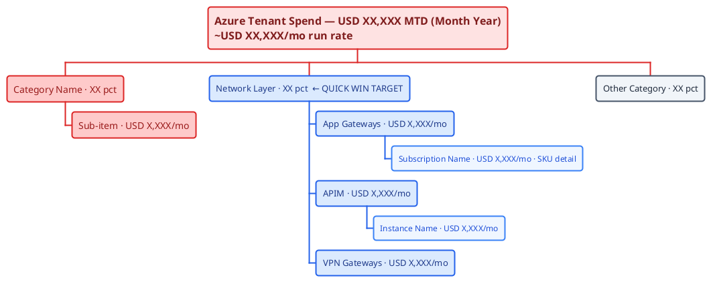
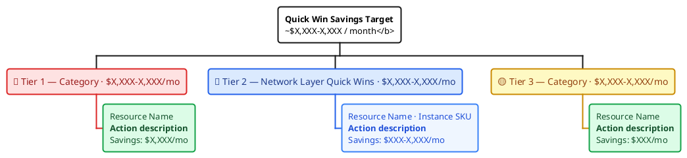

# PlantUML Style Guide

Standard style for PlantUML diagrams in this repository. All `.puml` files should follow these conventions to produce consistent, professional diagrams that render well as PNG attachments on Notion Live Docs.

## File Location

Store `.puml` files under `assets/<page_id>/` where `<page_id>` is the Notion page ID the diagram belongs to. Use descriptive filenames without the page ID prefix.

```
assets/
  <PAGE_ID>/
    data-flow.puml
    header-banner.puml
```

## Azure Icons (Azure-PlantUML)

Use the [Azure-PlantUML](https://github.com/plantuml-stdlib/Azure-PlantUML) sprite library for Azure service icons. Always include the simplified and common definitions, then add only the specific service sprites needed.

```plantuml
!define AzurePuml https://raw.githubusercontent.com/plantuml-stdlib/Azure-PlantUML/master/dist
!includeurl AzurePuml/AzureSimplified.puml
!includeurl AzurePuml/AzureCommon.puml
!includeurl AzurePuml/Databases/AzureSqlServer.puml
!includeurl AzurePuml/Analytics/AzureDataLakeStoreGen1.puml
```

### Do NOT Use Azure Macros for Layout Control

The Azure-PlantUML convenience macros (`AzureSqlServer(alias, "Label", "Desc")`) force vertical layout and ignore `left to right direction`. Instead, use raw `rectangle` elements with `<$Sprite>` references inside them.

```plantuml
' ❌ BAD — macros override layout direction
AzureSqlServer(src, "Azure SQL", "8 databases")

' ✅ GOOD — rectangles with sprites, layout-friendly
rectangle "<color:#1A73C7><$AzureSqlServer></color>\n<b>Azure SQL</b>\nProd-azsql-03\n//8 source databases//" as SRC #E8F0FE
```

## Vertical (Top-to-Bottom) Layout

Use explicit `-down->` arrows for vertical flow. Do **not** use a `together` block or `left to right direction` — vertical orientation is preferred for pipeline/flow diagrams on Notion because it fills the page width naturally.

```plantuml
rectangle "..." as A #E8F0FE
rectangle "..." as B #F5DEB3
rectangle "..." as C #E8E8E8

A -[#CD7F32]down-> B : extract
B -[#808080]down-> C : transform
```

## Color Scheme — Medallion Architecture Layers

Use layer-matched background colors for rectangles and arrow colors that match the target layer.

| Layer | Background | Icon Color | Arrow Color |
|---|---|---|---|
| Source | `#E8F0FE` (light blue) | `#1A73C7` | — |
| Bronze | `#F5DEB3` (wheat) | `#CD7F32` | `#CD7F32` |
| Silver | `#E8E8E8` (light gray) | `#808080` | `#808080` |
| Gold | `#FFF8DC` (cornsilk) | `#DAA520` | `#DAA520` |
| Consumers | `#E8F0FE` (light blue) | `#1A73C7` | `#1A73C7` |

## Color Scheme — Topic Article Diagrams

Topic articles (non-medallion) use **complementary color pairs** from the color wheel. Each article gets a unique palette so diagrams are visually distinct. Do **not** reuse the medallion colors (Bronze `#F5DEB3`, Silver `#E8E8E8`, Gold `#FFF8DC`) outside of medallion architecture diagrams.

Pick two complementary hues (opposite on the color wheel) and use light tints for backgrounds with saturated shades for icons and arrows.

| Article | Color A | Color B | Notes |
|---|---|---|---|
| AI Copilot & Agentic Automation | Purple (`#7C3AED` / `#EDE9FE`) | Amber (`#D97706` / `#FEF3C7`) | |
| API, APIM & Microservices | Teal (`#0D9488` / `#CCFBF1`) | Rose (`#E11D48` / `#FFE4E6`) | |
| Azure Policy & Governance | Red (`#DC2626` / `#FEE2E2`) | Green (`#16A34A` / `#DCFCE7`) | |
| CI/CD & GitHub Delivery | Blue (`#2563EB` / `#DBEAFE`) | Orange (`#EA580C` / `#FFEDD5`) | |
| Cloud Operations & Enablement | Slate (`#475569` / `#F1F5F9`) | Gold (`#CA8A04` / `#FEF9C3`) | Not medallion gold |
| Cross-Cloud Drift | Emerald (`#059669` / `#D1FAE5`) | Pink (`#DB2777` / `#FCE7F3`) | |
| Fabric Scheduling & Orchestration | Indigo (`#4F46E5` / `#E0E7FF`) | Tangerine (`#EA580C` / `#FFEDD5`) | |
| IaC Foundations | Sky (`#0284C7` / `#E0F2FE`) | Rose (`#E11D48` / `#FFE4E6`) | |
| Fabric Architecture & Engineering | — | — | Uses medallion palette |
| Networking, IPAM & Certs | Cyan (`#0891B2` / `#CFFAFE`) | Vermillion (`#DC2626` / `#FEE2E2`) | |
| Platform Engineering | Violet (`#7C3AED` / `#F5F3FF`) | Lime (`#65A30D` / `#ECFCCB`) | |
| Security, Sentinel & Observability | Amber (`#D97706` / `#FEF3C7`) | Navy (`#1E40AF` / `#DBEAFE`) | |

### Palette Selection Rules

- Pick two colors roughly opposite on the color wheel (e.g., blue + orange, purple + gold)
- Use 3–5 shades per hue: a dark shade for icons/arrows, a mid shade for alternate nodes, and a light tint for backgrounds
- Keep backgrounds pastel (`#F_____` or `#E_____` range) — dark backgrounds clash with Segoe UI text
- If a diagram depicts medallion layers, use the medallion palette for those nodes and the topic palette for non-medallion nodes

## Skinparam Defaults

Every diagram should include these base settings:

```plantuml
skinparam backgroundColor transparent
skinparam defaultFontName "Segoe UI"
skinparam rectangleBorderThickness 2
skinparam arrowThickness 2
```

- **Transparent background** — blends with any Notion page theme.
- **Segoe UI** — matches the Atlassian/Microsoft UI font family.
- **Thicker borders and arrows** — readable at smaller zoom levels.

## Scaling for Notion

Do **not** add a `scale` directive by default — native scale (1x) produces the best balance of size and clarity. The publish script renders to PNG and uploads as a page attachment displayed at 50% page width (`mediaSingle` width 50%), centered.

If a diagram appears too small at 50% width, increase to `scale 1.5` or `scale 2` as needed, but start without it.

## Rectangle Node Format

Each rectangle follows a consistent multi-line label pattern:

```
<color:#HEX><$Sprite></color>
<b>Layer Name</b>
resource-name
//detail annotation//
```

- Line 1: Colored sprite icon
- Line 2: Bold layer or service name
- Line 3: Specific resource identifier
- Line 4: Italicized count or description

## Dashboard-Style Visualizations ("Power BI in PlantUML")

Use this pattern when the user wants cost breakdowns, spend analysis, savings priority stacks, or KPI-style visualizations — the "Power BI dashboard but in PlantUML" style.

### ⚠ Never Use Pie Charts

`@startpie` and `pie showData` are **not supported in PlantUML 1.2024.7**. They render a syntax error PNG with exit code 200 — not a real chart. Do not use them. Replace pie charts with `@startwbs` trees.

### Chart Type Selection

| Use Case | Type | Notes |
|---|---|---|
| Spend breakdown by category/subscription | `@startwbs` | Hierarchical tree; color-coded by tier |
| Savings priority stack | `@startwbs` | 3–4 tiers with save sub-nodes |
| Before/after optimization waterfall | `@startuml` component | Left-to-right with colored arrows |
| Architecture flow | `@startuml` component | Vertical; see existing style guide |

### Standard Cost Tier Color System

Use this palette consistently for cost and savings dashboards:

| Tier | Class | Background | Border | Use |
|---|---|---|---|---|
| Critical spend / Tier 1 | `.hi` | `#FECACA` | `#DC2626` | Top cost drivers (SQL MI, VMs) |
| High spend / Tier 2 | `.mid` | `#FED7AA` | `#EA580C` | Mid-tier costs (App GW, Fabric) |
| Moderate spend / Tier 3 | `.lo` | `#FEF9C3` | `#CA8A04` | Lower-priority items (Defender, VPN) |
| Network resources | `.net` | `#DBEAFE` | `#2563EB` | App GW + APIM + VPN — quick win targets |
| Network sub-items | `.netsub` | `#EFF6FF` | `#3B82F6` | Per-subscription breakdowns under net |
| Fixed / expected | `.fixed` | `#F1F5F9` | `#475569` | Costs that are justified and not targets |
| Root node | `.top` | `#FEE2E2` | `#DC2626` | Single root node with total spend |
| Savings node | `.save` | `#DCFCE7` | `#16A34A` | What you save — always green |

### WBS Spend Breakdown — Canonical Template



**Rules:**
- Root node uses `\n` for line breaks inside labels
- Percentages: `XX pct` (use `pct` not `%` — percent sign causes parse errors in some versions)
- Deep nesting (4 levels) works fine — use it to show per-subscription breakdowns
- Include real instance names and SKU tiers where known (`WAF_v2 cap 3`, `StandardV2`)
- Network resources always get `<<net>>` / `<<netsub>>` regardless of spend tier

### WBS Savings Priority Stack — Canonical Template



**Rules:**
- Tier 1 = SQL MI, VMs — high-dollar, may need RI or architecture decisions
- Tier 2 = Network resources (App GW, APIM, VPN) — **always blue, always second tier** — they're high-effort-to-savings-ratio quick wins
- Tier 3 = Defender exemptions, orphaned gateways, log retention
- Include `\n` to break long labels across lines
- Use emoji tier labels (🔴🔵🟡) in the tier headers for scannability
- Sub-nodes under `.net` tiers use `.netsave` (light blue background)

### Waterfall Diagram — Canonical Template


**Rules:**
- Source node: red background `#FEE2E2`
- Cut nodes: green background `#DCFCE7`; savings in `<color:#16A34A>` inline
- End node: blue background `#DBEAFE` (optimized = net positive)
- Arrow labels carry the cumulative delta: start red, cut arrows green
- Keep to 5–7 cut steps — beyond that the diagram gets too wide for Notion

### Three-Chart Page Pattern

For cost optimization pages, use this standard three-chart structure at the top:

```markdown
## Spend at a Glance
!plantuml(assets/{pageId}/spend-breakdown.puml)

## Quick Win Savings Priority Stack
!plantuml(assets/{pageId}/quick-wins.puml)

## Optimization Waterfall — $XX,XXX → $XX,XXX
!plantuml(assets/{pageId}/cost-waterfall.puml)
```

Always put the spend breakdown first (where is the money), quick wins second (what to cut), waterfall third (net impact).

### Verifying Diagrams Before Publishing

Always verify locally before running the publish script:

```bash
# Render to PNG and check exit code + file size
cat assets/{pageId}/diagram.puml | java -Djava.awt.headless=true -jar /tmp/plantuml.jar -tpng -pipe > /tmp/test.png 2>/dev/null
echo "exit: $?  size: $(wc -c < /tmp/test.png) bytes"

# Check PNG dimensions — error PNGs are ~425×161, real diagrams are 1000px+ wide
python3 -c "
import struct
with open('/tmp/test.png','rb') as f:
    f.read(8); f.read(4); f.read(4)
    w = struct.unpack('>I', f.read(4))[0]
    h = struct.unpack('>I', f.read(4))[0]
print(f'{w}x{h}')
"
```

| Exit code | Size | Verdict |
|---|---|---|
| 0 | > 30 KB | ✅ Good — publish it |
| 0 | < 5 KB | ⚠ Suspicious — check dimensions |
| 200 | Any | ❌ PlantUML syntax error — do not publish |

**PlantUML jar:** `/tmp/plantuml.jar` (v1.2024.7) — not persistent across reboots; re-download with:
```bash
wget -q -O /tmp/plantuml.jar https://github.com/plantuml/plantuml/releases/download/v1.2024.7/plantuml-1.2024.7.jar
```

**Wrapper script** at `~/.local/bin/plantuml` calls `java -Djava.awt.headless=true -jar /tmp/plantuml.jar`. Always pass `-Djava.awt.headless=true` — the server has no X11 display.

### Reference Implementation

`assets/<PAGE_ID>/` — the Azure Cost Optimization June 2026 Quick Wins page. All three chart types implemented with real cost data:
- `spend-breakdown.puml` — WBS spend tree with network layer highlighted blue
- `quick-wins.puml` — WBS savings priority stack with 3 tiers
- `cost-waterfall.puml` — left-to-right optimization waterfall

## Canonical Example

See [assets/<PAGE_ID>/data-flow.puml](../../assets/<PAGE_ID>/data-flow.puml) for the reference implementation of the Azure architecture flow style.
